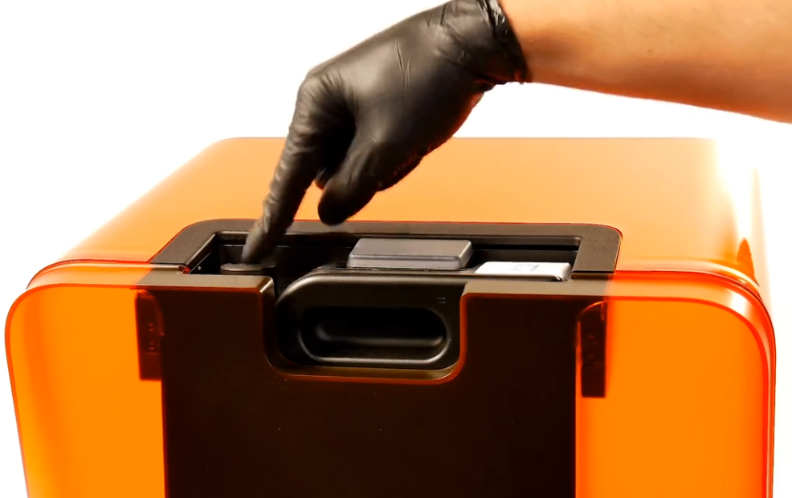
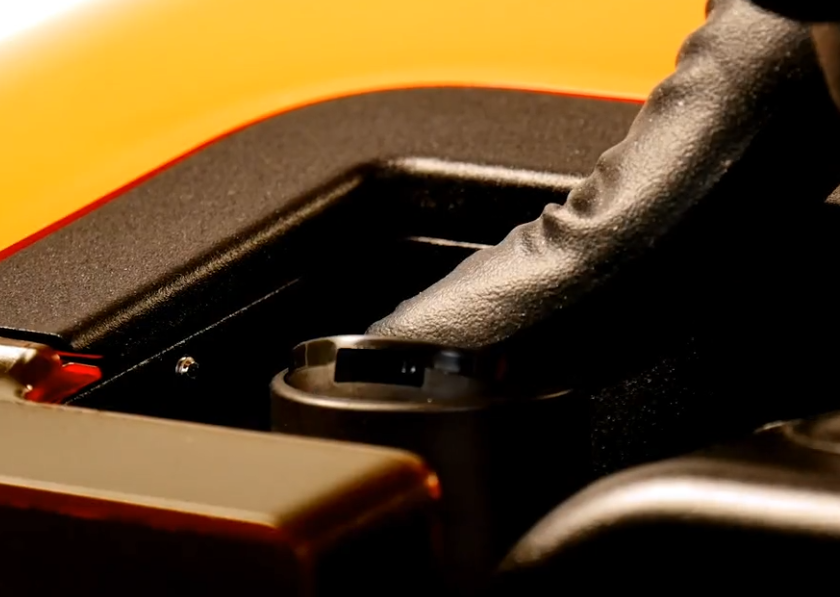
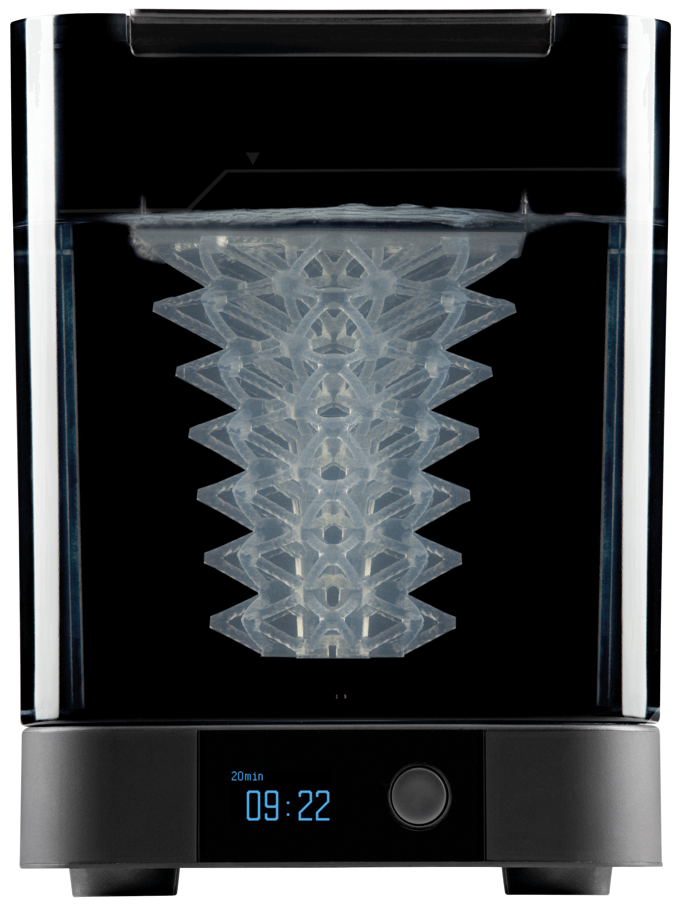
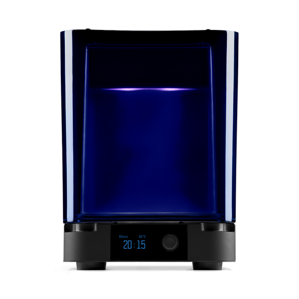

# Form 3 Resin 3D Printer

**For at benytte resin-printeren i labbet skal du have kørekort hertil.** Dette opnåes ved at gennemføre DD Lab's resin print workshop. Kontakt DD Lab for at arrangere en sådan workshop, enten ved at gå til en DD Lab medarbejder i labbets åbningstid, skrive til os på [facebook](https://www.facebook.com/AUDDLab) eller skrive en e-mail til os på [ddlabau@gmail.com](mailto:ddlabau@gmail.com).

Denne guide vil gå i dybden med processen fra klargøring af din 3D model til færdigt print. **Vi anbefaler at du ser denne 5 minutter's video** inden du læser guiden, for bedre at forstå hvad der refereres til:

## Indhold
<!-- TOC titleSize:2 tabSpaces:2 depthFrom:2 depthTo:6 withLinks:1 updateOnSave:1 orderedList:0 skip:1 title:0 charForUnorderedList:* -->
* [Komponenter](#komponenter)
* [Klargør dit print med PreForm](#klargør-dit-print-med-preform)
  * [Opsætning i PreForm](#opsætning-i-preform)
* [Print med Form 3](#print-med-form-3)
  * [Start dit print](#start-dit-print)
  * [Efter printet er printet](#efter-printet-er-printet)
  * [SIKKERHED](#sikkerhed)
* [Form Wash](#form-wash)
  * [Start rensning af printet](#start-rensning-af-printet)
  * [Efter printet er renset](#efter-printet-er-renset)
  * [SIKKERHED](#sikkerhed)
* [Form Cure](#form-cure)
  * [Start curing af printet](#start-curing-af-printet)
  * [Efter curing af printet](#efter-curing-af-printet)
* [Wash og Cure tidsrum og temperaturer for resin i labbet](#wash-og-cure-tidsrum-og-temperaturer-for-resin-i-labbet)
<!-- /TOC -->

## Komponenter

<table>
  <tr>
    <td></td>
    <td> 
1. Resin Cartridge - hvorfra ny resin fyldes på printeren   2. Status light   3. Cover - der kun skal være åbent når det er nødvendigt.  4. Build Platform - hvorpå printet printes   5. Resin Tank - hvor i resinen fra resin cartridge på fyldes for at kunne printe på build platformen   6. Touchscreen - hvorpå prints igangsættes   7. Status light   8. Leveling disc
 </td>
  </tr>
</table>

## Klargør dit print med PreForm

PreForm er formlabs' software til at forberede 3D modeller til at blive printet på Form 3 printeren.

Ud over at vælge detaljegrad og generere support til dit print kan du redigere størrelse, retning og "layout" i PreForm.

For at kunne bruge PreForm skal din 3D model enten være en **STL- eller OBJ-fil**

De maksimale mål for printet er: **14,5 × 14,5 × 18,5 cm**

**[PreForm kan downloades her](https://formlabs.com/software/#preform)**

### Opsætning i PreForm

Du kan forberede dit print før du slutter din computer til printeren.

Efter du har downloaded PreForm skal du sætte printeren op med følgende indstillinger (Indstillingerne kan ændres igen når som helst):
- Vælg printer: Form 3
- Vælg resin: Grey V4
  - Vi kan til tider have andre resiner sat i printeren, i det tilfælde kan det ses på klistermærket på tanken (punkt 5 på billedet ovenfor), der er sat i printeren (spørg evt. en ansat i labbet for at være sikker).
- Layer thickness: Vælg alt efter hvor høj opløsning du ønsker dit print (eller hvor lang tid du har til at printe).

Forbered dit print til at blive printet, ved at følge [PreForm guiden her](https://support.formlabs.com/s/article/PreForm?language=en_US).

**Tips til support settings**

- Vælg mini rafts, det sparer på resin
- touchpoint size kan ændres til 0.30 da større supportpinde giver et "udslæt" på printet, så vælg support der er så lille som muligt for at mindske "udslættet".
- density er hvor tæt supportpindene placeres kan være 0.90
- advanced settings: Afstand over build platformen kan sættes ned til 2 mm for at spare på resin
- print ikke modellen direkte på build platformen!

**Ved store modeller**

Større modeller der ikke behøver at være masive bør udhules for at spare på resin. Dette kan gøres med autodesk's gratis værktøj [Meshmixer](http://www.meshmixer.com/download.html).

**Følg [denne guide](https://formlabs.com/blog/how-to-hollow-out-3d-models/)** for at udhule dit print, samt lave udløbshuller så modellen printes korrekt.

Hvis du udhuler dit print er det vigtigt at tilføje **minimum 2 udløbshuller** til din model, så resin på indersiden af printet kan løbe ud.

## Print med Form 3

Du har nu forberedt din 3D model i PreForm og er klar til at starte dit print.

### Start dit print

**1. Klargør printeren**

- Tag stofposen af printeren.
- Tag resin cartridge ud og ryst det lidt og sæt det tilbage (check at luftningsslusen er lukket inden du ryster).
- Kig ned i resin tanken for at sikre at der ikke er stykker af størknet resin der flyder rundt i den flydende resin.
- Tjek på displayet på printeren, at resin tanken og cartridge er indsat korrekt, og der er resin i printeren. Hvis dette ikke er tilfældet, henvend dig til en ansat i DD Lab.
- Tjek at build platform (Punkt 4 på billedet ovenfor) er isat korrekt.

**2. Upload dit print**
- Sæt din computer til printeren med USB kablet der er tilsluttet printeren.
- Tænd for filteret placeret bag ved printeren med fjernbetjeningen
- **Ifør dig handsker!** (Findes til venstre for printeren eller på hylden under printeren)
- Åben for luftslusen på resin cartridge i toppen af printeren (Se billederne nedenfor).

- Du kan nu tage handskerne af indtil printet er færdig med at printe.
- Tryk "*Start a print*" i PreForm
- Vælg printeren "*AheadIbis*"
- Tryk "*Upload job*"
- Tryk på "*Print*" på printeren's display

Dit print er nu i gang og du kan se hvor længe det tager. Du har lov til at forlade labbet mens dit print printes.

### Efter printet er printet
- **Ifør dig handsker**
- Luk for luftslusen på resin cartridge i toppen af printeren.
- Åben for låget/cover på printeren
- Frigør buildplatformen og tag det ud af printeren.
- Luk låget/cover på printeren

Hvis printet er småt nok kan du overfør build platformen direkte til Form Wash (se under [Form Wash](#form-wash) hvordan dette gøres)

Hvis størrelsen på printet ikke kan være i Form Wash når det sidder på build platformen, frigør printet fra build platformen. Brug evt. mounten til at stabilisere mens du gør dette, men vær forsigtig, da printet er skrøbeligt.

**Husk at betale for vægten af dit print på vores [webshop](https://ddlab.au.dk/webshop).**

### SIKKERHED

Resin er sundhedsskadeligt. Undgå derfor at indånde dampe fra det samt at få det på huden.

Låget på printeren bør derfor kun være åbent når det er nødvendigt (for at tage printet ud af printeren og for at isætte build platform i printeren igen).

Når dit print er færdigt og du vil fjerne det fra printeren, overføre den til Form Wash og/eller afmontere printet fra build platformen er det vigtigt at du **TAGER HANDSKER PÅ!**

Hvis du får resin på huden skal du hurtigst muligt vaske området grundigt med sæbe.

Hvis du spilder resin bør det tøres op med et papirhåndklæde med rigeligt isopropylalkohol på. Brug papir fra rullen i vinduet og alkohol fra spøjteflasken på bordet.

## Form Wash
<!--  -->

### Start rensning af printet
**Klargør Form Wash til printet**
- **Ifør dig handsker**
- Se på væskeniveauet på Form Wash og tjek at niveauet ligger mellem afmærkningerne for det maximale og minimale væskeniveau. Hvis dette ikke er tilfældet skal du henvende dig til en ansat i labbet.
- Åben For Wash ved at trykke ind på drejeknappen på Form Wash, vælge "Open" ved at dreje knappen og bekræfte ved at trykke på drejeknappen. Herefter løfter låget i Form Wash sig.
- Åben låget på printeren, trykke armen op oven på build platformen, hvorefter build platformen kan aftages ved at slide den ud mod dig selv. Pas på hvis der drypper resin fra printet.

**Overfør dit print til Form Wash**
- Overfør build platformen med dit print til Form Wash ved at slide den ind på holderne over kurven.
- Brug drejeknappen til at vælge "Sleep", hvorefter printet synkes ned i væsken.
- Med drejeknappen kan der nu vælges tiden for wash. Anbefalede vaske-tidsrum for resiner tilgængelige i labbet kan findes [her](#wash-og-cure-tider-og-temperaturer-for-resin-i-labbet).
- Du kan nu tage handskerne af (indtil efter printet er vasket).

Du må gerne forlade labbet mens dit print renses, en vær venligst tilbage inden rensningen er færdig, da Form Wash vil hæve printet op når den er færdig, hvilket vil efterlade tanken åben for isopropylalkoholen, der vil fordampe.

### Efter printet er renset
**Afmontér printet fra build platformen**
- **Ifør dig handsker**
- Slide build platformen af Form Wash/Tag dit print ud af kurven
- Brug igen drejeknappen til at vælge "Sleep", hvorefter Form Wash lukkes
- Hvis printet ikke allerede er afmonteret fra build platformen skal det gøres nu. Brug evt. build platform mounten samt en spatel (findes på siden af Form Wash) til at stabilisere afmonteringen af printet fra build platformen. Vær forsigtig, da printet stadig er skrøbeligt.
- Rens build platformen med isopropylalkohol fra sprøjteflasken med alkohol på bordet, og aftør build platformen med mikrofiberkluden på bordet.
- Åben printeren og sæt build platformen tilbage i printeren.
- Luk låget til printeren og sæt stofposen tilbage over printeren.

**Lad dit print tørre**
- Sæt dit print et sted for at **tørre i min. 30 minutter** (helst iKKE i direkte solskin).
- Du kan nu tage handskerne af (indtil dit print skal cures)
- Brug fjernbetjeningen til filteret til at sætte en timer på 2 timer (aktuelle indstillinger er angivet med lamperne på siden af filteret, der vender hen mod vinduet).

### SIKKERHED

Væsken i Form wash er isopropylalkohol. Denne væske er brandfarlig og sundhedsskadelig hvis det rører huden eller damene fra det indåndes. Derudover er der resin-rester i væsken i maskinen. **Låget til Form Wash bør derfor IKKE åbnes unødvendigt!**

Derfor bør du være iført handsker når du sætter prints i og tager prints ud af Form Wash.

Hvis du får isopropylalkohol på huden skal du hurtigst muligt vaske området grundigt med sæbe.

Hvis du spilder isopropylalkohol bør det tøres op med et papirhåndklæde. Brug papir fra rullen i vinduet.

## Form Cure

### Start curing af printet
- **Ifør dig handsker**
- Åben Form Cure, placér dit print på den runde skive og luk Form Cure
- Du kan nu tage handskerne af for sidste gang
- Tryk på drejeknappen for at tænde Form Wash
- Drej på knappen for at vælge den korrekte tid og temperatur til resinen du har brugt. Anbefalede cure-tidsrum for resiner tilgængelige i labbet kan findes [her](#wash-og-cure-tider-og-temperaturer-for-resin-i-labbet).

### Efter curing af printet
Printet kan er nu færdigt og kan røres uden at iføre sig handsker. Vær opmærksom på at printet kan være varmt lidt tid efter det er færdigt i Form Cure.

## Wash og Cure tidsrum og temperaturer for resin i labbet

|Resin| Wash-tid | Cure-tid | Cure-temperatur|
|---|---|---|---|
|Formlabs Photopolymer Resin Grey V4 | Min. 10 minutter | Anbefaling: min. 30 minutter Fuld cure: 60 minutter| 60 &deg;C |
|Formlabs Photopolymer Resin Flexible 80A | 10 minutter + 10 minutter i ren Isopropylalkohol*| Fuld cure: 10 minutter| 60 &deg;C |
|Formlabs Photopolymer Resin Tough 2000 | 10 minutter + 10 minutter i ren Isopropylalkohol*| Anbefaling: 60 minutter | 70 &deg;C |

*Brug det seperate rensekit på hylden under printerbordet til at rense anden gang i ren Isopropylalkohol.

[Indstillinger for andre resiner kan findes her.](https://support.formlabs.com/s/article/Choosing-the-Right-Material?language=en_US)
