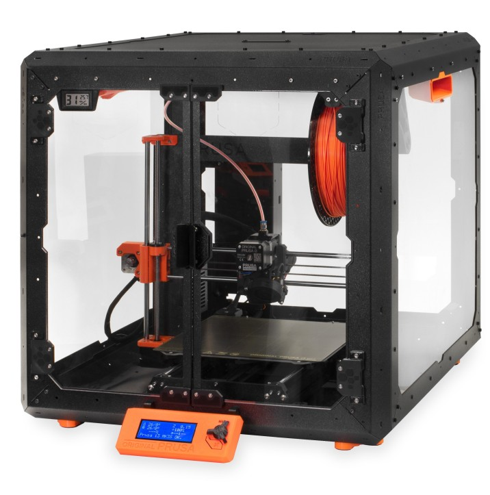
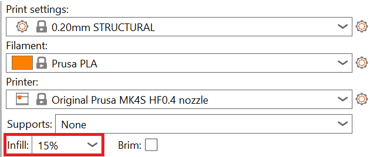

# Guide til Prusa-filamentprintere

## Indhold

* [Før du printer](#før-du-printer)
* [Hvis du ikke vil lave din egen fil](#hvis-du-ikke-vil-lave-din-egen-fil)
* [Klargøring af fil i PrusaSlicer](#klargøring-af-fil-i-prusaslicer)
* [Før du starter print](#før-du-starter-dit-print)
  * [Indsæt filament](#indsæt-filament)
* [Efter dit print er færdigt](#efter-dit-print-er-færdigt)
  * [Fjern filament](#fjern-filament)
  * [Fjern dit færdige print](#fjern-dit-færdige-print)
* [Brug af filter til usunde materialer](#brug-af-filter-til-usunde-materialer)
* [Tips og tricks til bedre print](#tips-og-tricks-til-bedre-print)
* [Materialer](#materialer)
* [Design af egne modeller](#design-af-egne-modeller)

  * [Valg af software](#valg-af-software)

---

## Før du printer

Før du bruger lab'ets Prusa Mini+, MK4 eller MK4S, skal du have følgende på plads:

 1. At du har fået undervisning i 3D printerne, eller har snakket med en ansat i lab'et
 2. At du har en 3D-model af filtypen STL eller OBJ, som du gerne vil printe.
 3. En computer med [*PrusaSlicer*](https://www.prusa3d.com/page/prusaslicer_424/) installeret.
 4. Et USB-stik som du kan gemme din fil på (disse sidder allerede i printerne).
5. At du har betalt for det materiale du bruger på vores [*webshop*](http://ddlab.au.dk/webshop).

---

## Hvis du ikke vil lave din egen fil

Det kan være vanskeligt og tidskrævende at designe sin egen fil. Heldigvis findes [*Thingiverse*](https://www.thingiverse.com/), hvor man kan downloade 3D-modeller gratis.

I dette eksempel tages der udgangspunkt i en [*Skak Bonde*](https://www.thingiverse.com/thing:4901226/files) fra sættet *Hexagon Chess Set*.

---

## Klargøring af fil i PrusaSlicer

Næste trin er at importere 3D-modelen til PrusaSlicer. Dette kan gøres ved at trykke på `File ➝ Import ➝ Import STL/OBJ/...`, hvorefter du vælger din fil.

Du kan herefter ændre på størrelsen af printet samt dens orientering ved hjælp af værktøjerne i bjælken til venstre. 
> *Hvis du ikke kan se din fil, kan det ske, at du skal skifte til *"3D editor view"* ved at trykke på kassen i nederste venstre hjørne.*

Hvis dit print vender forkert kan du enten bruge `Rotate` eller `Place on Face` funktionenerne i venstre bjælke til at vende det korrekt. 

Du kan også roterer din model manuelt ved at skrive værdierne ind i tabellen til højre.

> *Place on Face funktionen er især nyttig, hvis man gerne vil at printet skal ligge på en bestemt side.*

Hvis du vil ændre modellens størrelse, kan du bruge ***"Scale"*** værtøjet til venstre eller manuelt skrive værdierne ind i tabellen til højre. 

---

## Vælg de rigtige indstillinger
Når du har klaret ovenstående, skal du herefter vælge hvilke instillinger, du gerne vil printe med. *Du skal her vælge følgende:*

**1. Hvilken printer du ønsker at bruge (Mini+, MK4 eller MK4S)**

Hvis du ikke kan finde den ønskede printer i drop-down menuen, kan du tilføje en ny printer ved at klikke på `Add/Remove printers` og køre PrusaSlicerens Configuration Wizard. Her skan du under `Prusa Research` vælge hvilke printere du ønsker at tilføje. 

  

  >*OBS: Denne guide tager  udgangspunkt i Prusa printeren *"Original Prusa i3 MK3S & MK3S +"*, som ikke længere findes i lab'et.* 

**2. Filamenttypen (PLA, PETG, ASA, FLEX TPU)**

Derefter skal du vælge hvilket filament du gerne vil printe med, så hvis du for eksempel gerne vil printe i PLA bør du vælge `Prusament PLA` eller `Generic PLA` afhængig af fabrikanten. Det er dog en god idé at undersøge, hvilke filamenttyper lab'et har på forhånd inden du vælger dette. 

  >*PLA er ofte et godt sted at starte, men hvis du ønsker at printe med et andet materiale kan du finde yderligere information om de forskellige filamenttyper længere nede i tips og tricks sektionen.* 

Det kan også være en god idé at klikke på tandhjulet ud for filament-indstillingen og sammenligne PrusaSlicers default værdier med de de anbefaligner der står på filamentrullen. Hold specielt øje med at diameteren på filament tråden samt de forskellige temperature er korrekte i overenstemmelse med de anbefalinger der står på rullen.

 

**3. Print settings (tykkelsen på filamenttråden målt i mm).**

Her skal du vælge hvor tyk en filamenttråd du vil printe med *(en god default er at bruge 0.20mm QUALITY)*. Du kan med fordel slice din fil med forskellige print settings for at se, hvor lang tid din model tager at printe samt hvor meget filament der bliver brugt ved de forskellige presets. 

For se hvor lang tid dit print tager,  samt hvor mange gram filament du bruger, skal du klikke på `slice now` i bunden af højre bjælke.

>*Hvis du  vælger *"0.10mm DETAIL"* tager dette print af skakbonden 1 time og 59 min, og bruger 6.62 gram filament, hvorimod *"0.20mm SPEED"* kun tager 1 time og bruger 6.34 gram filament.* 
---

## Andre indstillinger

Udover disse kan du i øverste bjælke justere indstillingerne for printpladen, print-indstillinger, filament, og selve printeren. Herunder finder du instillinger såsom ``temperatur,  infill, support-materiale, ventilation m.m``, som kan være nyttigt at ændre afhængig af dit print. 

>*Dette kan lyde overvældende, men heldigvis kan man komme virkeligt langt med PrusaSlicerens default instillinger*

Du undrer dig måske over, hvorfor det samme print kan bruge mere eller mindre filament, alt efter hvor hurtigt det bliver printet. Det skyldes blandt andet, at fyldet inde i printet, bedre kendt som ``infill``, ændrer sig afhængigt af hvilken indstilling du vælger. Du kan ændre mængden af infill over i højre bjælke, som vist på billedet

  >*Hvis du gerne vil se, hvor solid din model bliver baseret på den valgte infill, kan du trække i baren til højre for at se et tværsnitsnit af dit print.*

Når din model har de rigtige dimensioner og er placeret korrekt på printpladen (*med den største flade nedad for et stabilt print*) kan du herefter slice din fil ved at klikke på `slice now` i bunden af højre bjælke.

---

Når du har valgt de indstillinger, som du vil printe med, skal du slice din fil en sidste gang og derefter eksportere den som G-code til printerens USB-stik (der sidder et USB-stik i hver printer).

Du eksporterer filen ved at tilslutte USB-stikket til din computer, klikke på ``Export G-code`` og gemme filen på USB-stikket. Sørg for at navngive filen korrekt i forhold til vores anvisninger: Dit ***AU-ID*** + ***hvor mange gram dit print vejer.***

---

## Før du starter print

### Indsæt filament

1. Find det filament du gerne vil printe med i en af kasserne under 3D-printerne.
2. Pak filamentet ud og klip herefter spidsen af filamenttråden på skrå, så printeren nemmere kan gribe fat om tråden. 
3. Tænd printeren, tryk på ``Filament`` under hovedmenuen og vælg herefter den type filament, du printer med. 
4. Placer filamentrullen korrekt i printeren og så tråden vender ud mod dig selv. 

     

5. Før herefter tråden igennem det lille hul i printerens enclosure indtil du møder modstand.

    

6. Tryk herefter på ``CONTINUE``. Hvis ikke printeren griber ordentlig fat i filamentet, skal du fører tråden længere ind.

7. Bekræft herefter om filamentet har den rigtige farve, når det kommer ud af printeren. 
    -  Hvis farven er korrekt vælg ``YES``. 
    - Hvis ikke vælg ``NO`` og lad printeren extrude lidt mere.

Du er nu næsten klar til at printe, men inden du starter printet, skal du dobbelttjekke:

1. At det filament, der sidder i printeren, svarer til det filament, du har valgt i indstillingerne i PrusaSlicer. *Hvis ikke [skal du skifte filament](#hvis-man-skal-skifte-filament)*

2. At den stålplade der sidder på printeren, er den rigtige i forhold til det filament du printer med. Som udgangspunkt printes der altid på satin-pladen, da den kan bruges til de fleste filamenttyper bortset fra TPU, her skal du bruge vores ``textured steel sheet`` i stedet.

3. At pladen er ren. Kom en lille smule isopropylalkohol (IPA) på et stykke papir (der står en stor rulle ved resin-printeren), og tør pladen grundigt af.

Sæt derefter USB-stikket tilbage i printeren, og start dit print. Hvis din fil ikke dukker op, når du sætter USB-stikket i printeren, skal du trykke på ``Print`` under hovedmenuen. Her kan du finde alle filerne på USB-stikket. Brug det sorte hjul til at scrolle gennem listen, indtil du finder din fil, og klik derefter på hjulet for at vælge den. Printeren vil nu begynde at varme op og kalibrere, hvorefter printet starter.

---

## Efter dit print er færdigt

### Fjern filament

1. Tænd printeren.
2. Tryk på ``Filament`` under hovedmenuen og vælg ``Unload filament``.
3. Vælg den filamenttype, der sidder i printeren.
4. Vent på at printeren varmer op (den bipper når den er varm nok), og træk herefter filamentet ud.
5. Læg filamentet tilbage i den rigtige kasse (se vejledningen i kassenerne for, hvordan du opbevarer filamentet korrekt)

---

### Fjern dit færdige print

1. Vent til printpladen er kølet af.
2. Løft pladen forsigtigt af printeren og undgå at placer dine fingre midt på pladen, da pladen nemt tager imod fugt.
3. Bøj pladen let, så printet løsner sig.

---

## Brug af filter til usunde materialer

Hvis du bruger PETG, ASA, ABS eller lignende materialer, skal filteret i enclosure’et være tændt under hele printet.

> *Ved print med PLA er filteret ikke nødvendigt.*

---

## Tips og tricks til bedre print

*(Denne sektion kan uddybes med: temperaturjusteringer, support-materiale, brims/rafts, korrekt Z-offset osv.)*

---

## Materialer

Du kan betale for materialer via [DD Labs webshop](http://ddlab.au.dk/webshop). Se prisskiltet ved printeren for korrekte materialetyper og priser.

---

## Design af egne modeller

### Valg af software

Nogle gode gratis programmer til 3D-modellering:

* [TinkerCAD](https://www.tinkercad.com/) – Let at bruge
* [Fusion 360](https://www.autodesk.com/products/fusion-360/) – Mere avanceret
* [Blender](https://www.blender.org/) – God til organiske former og figurer

