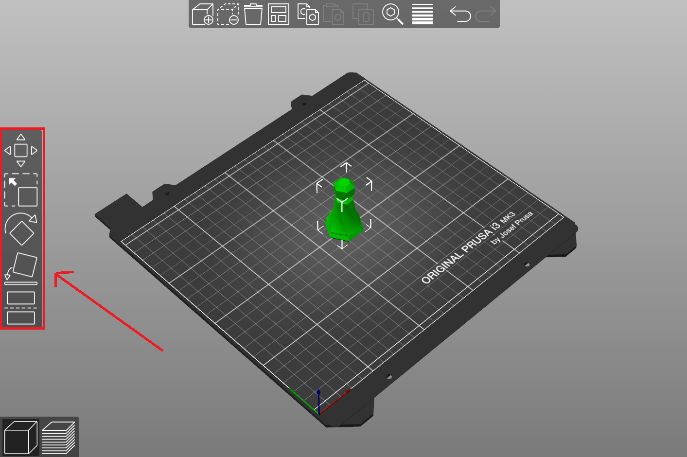
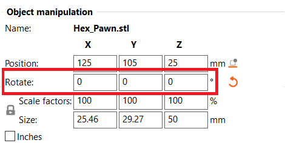
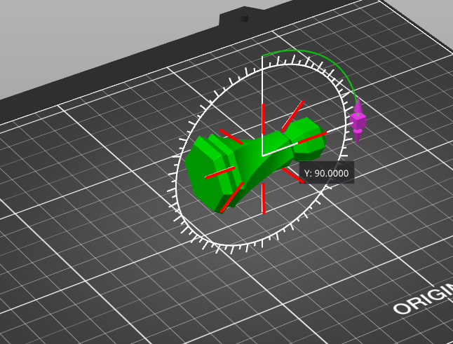
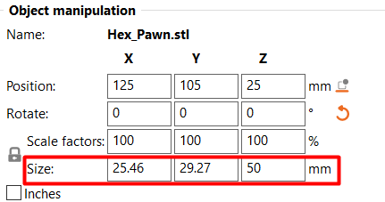
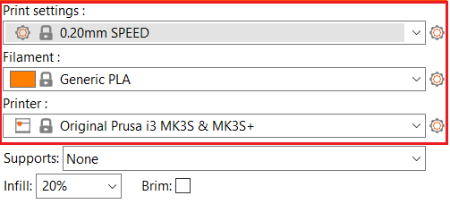
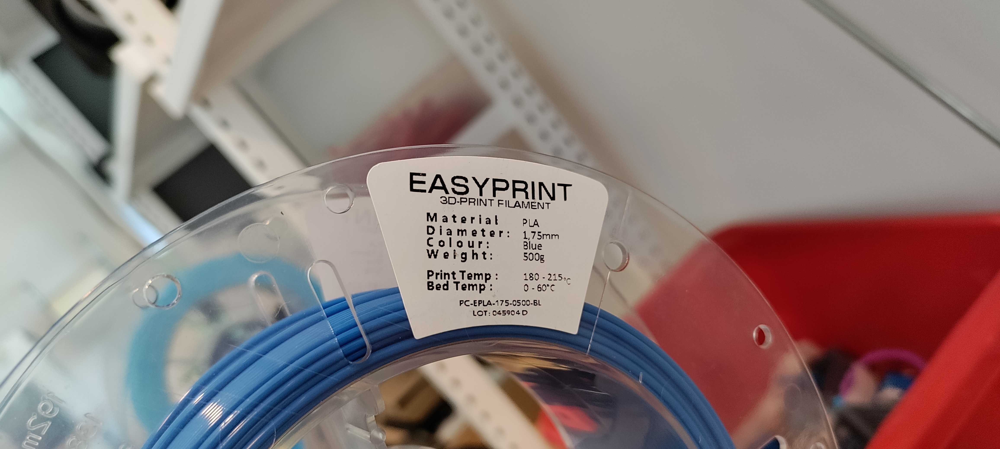
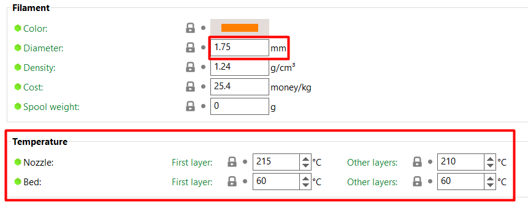
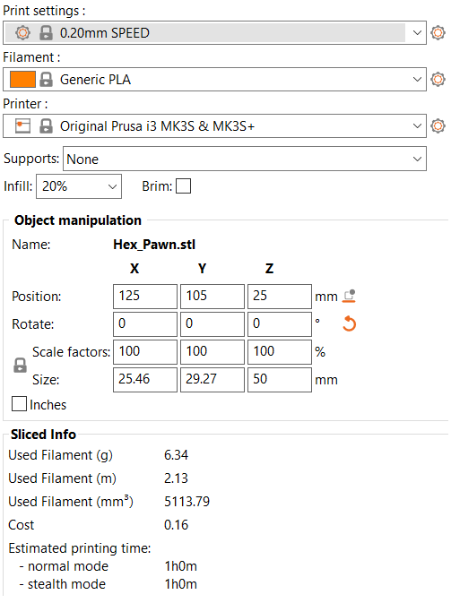
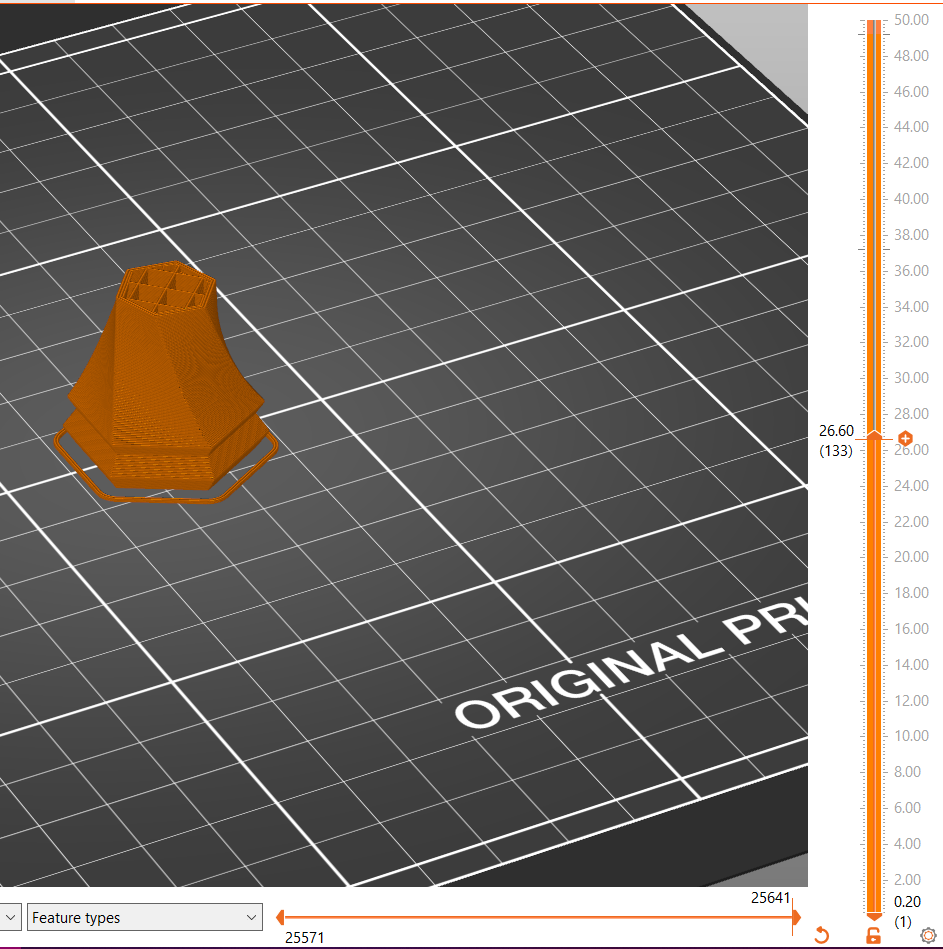

# 3D printer
## Indhold
- [Før du printer](#før-du-printer)
- [Hvis man ikke vil lave sin egen fil](#Hvis-man-ikke-vil-lave-sin-egen-fil)
- [Gør fil klar til print i PrusaSlicer](#g%C3%B8r-fil-klar-til-print-i-prusaslicer)
- [Optionelle tricks til bedre print](#optionelle-tricks-til-bedre-print)
- [Materiale](#materiale)
  - [Skift materiale:](#skift-materiale)
  - [Fjerne færdigt print:](#fjerne-f%C3%A6rdigt-print)
- [Design af egne modeller](#design-af-egne-modeller)
  - [Valg af program](#Valg-af-program)

## Før du printer
Når man bruger Lab'ets Prusa i3 MK3 så kræver det at man har føglende:

 1. Hvis det er første gang, skal man have snakket med en ansat i Lab'et
 2. En 3D-fil af filtypen STL eller OBJ.
 3. En computer med [PrusaSlicer](https://www.prusa3d.com/page/prusaslicer_424/) installeret.
 4. Et SD Kort - der bør sidde et kort i prusa printerne lige til venstre for displayet.
 5. Et [link til DD Labs webshop](http://ddlab.au.dk/webshop) til betaling af materiale.

## Hvis man ikke vil lave sin egen fil
Det kan være vanskeligt og tidskrævende at designe sin egen fil. Heldigvis findes [Thingiverse](https://www.thingiverse.com/), som er en delingside for makere, hvor man kan downloade gratis 3D-modeller af alt fra skakbrikker til droneskeletter.

I dette eksempel vil jeg tage udgangspunkt i en [Skak Bonde](https://www.thingiverse.com/thing:4901226/files) fra sættet "Hexagon Chess Set".

## Gør fil klar til print i PrusaSlicer
Næste trin er at åbne sin 3D-fil i PrusaSlicer. Dette kan gøres ved at trykke på `File` ➝ `Import` ➝ `Import STL/Obj/...` og så vælge sin STL/Obj/... fil.

Filen er nu importeret og man kan da ændre på størrelsen af printet og orientering ved hjælp af værktøjerne i venstre side.  

Her er et par ekssempler på hvordan man ville sikre sig at ens print er i dne rigtige orientation of størrelse. For eksempel, hvis nu ens print er blevet importeret men er i den forkerte orientation kan man enten manuels rotere det, eller bruge "lay on face" funktionen i prusaSlicer hvilket jeg ville anbefale hvis man har een bestemt flad side man gerne vil have sit print til at ligge på.
Hvis man manuelt roterer kan man enten i højre side skrive rotations værdier ind (hvis man har valgt sit objekt med venstreklik)

Eller man kan frit rotere ved at bruge "rotation" værktøjet der er en del af værktøjerne i venstre side. Et tip til rotation værktøjet er at hvis man holder sin mus over de guide linjer der vises når man har valgt på hvilken akse man roterer, så kan man "snap" sin rotation til de linjer, ikke noget med at holde Ctlr, Shift, Alt eller lignende.

Derefter kan man justere størrelsen på sin fil med "scale" værktøjet i samme værktøjsrække som "rotate", eller man kan skrive værdier ind manuelt til højre, igen ligesom med rotate værktøjet, nu bruger man blot felterne ud fra "Size:"

Når filen har de rigtige dimensioner og er lagt korrekt ned på printpladen **med den største flade side nedad for et stabilt print** skal man gøre klar til at "slice" sin fil. Kort sagt er det en konvertering af filen til en type som printeren kan forstå, der gør brug af alle de instillinger man har instillet i ens "slicer" f.eks. PrusaSlicer. Den ene halvdel af at gøre klar til at slice er allerede overstået (den del hvor man orienterer og skalerer sit print) den anden del er hvor man siger hvordan printeren skal printe med hensyn til hvilket fillament der gøres brug af, hvilken detaljegrad man vil printe i, og indstillinger som hvilken temperatur printpladen skal være og hvilken temperatur dyssen som fiallamentet smeltes igennem skal have. Det kan lyde overvældende, men heldigvis kan man komme virkeligt langt med presets og at læse hvad der står på siden af ens printmateriale rulle. I sin simpleste form er der kun 3 indstillinger man skal indstille.

1. Det kan være en god idé at starte fra bunden i de indstillinger PrusaSlicer har i højre side før man slicer. Start derfor med at vælge hvilken maskine der gøres brug af. I denne guide tages der udgangspunkt i Prusa printerne "Original Prusa i3 MK3S & MK3S +".

2. Derefter vælger man det fillament man vil bruge, det har man forhåbentligt gjort sig nogle tanker om på forhånd, ellers er der yderligere information om de forskellige fillamenter DD lab har længere nede i tips og tricks sektionen. Til de fleste 3d print print kan og bør man bruge generisk PLA. Det kan også være en god idé at dobbelt tjekke de preset værdier der følger med en fillament type. De kan ses på siden af fillamentrullen over printeren. Hold specielt øje med at diameteren er rigtig, og at de forskellige print temperature er sat korrekt i overenstemmelse med de anbefalinger der står på rullen.

 

3. Print settings. Her vælger man hvilket overordnet preset man vil gøre brug af (en god default er at bruge 0.15mm QUALITY). Det kan anbefales at slice ens fil i et par forskellige af dem for at se neders til højre i programmet hvor lang tid hvert af dem vil tage at printe og hvor meget fillament det vil bruge. For eksempel, med print settings (de der set til højre i programmet, ikke fane menuen der forvirrende også hedder print settings) sat til 0.10mm DETAIL, tager dette print af skak bonden 1 time og 59 min, og bruger 6.62 gram fillament. Med en indstilling sat til 0.20mm SPEED tager printet "kun" 1 time og bruger 6.34 gram fillament. For at se tid og gram klikker man blot "slice now" i bunden af programmet og så kan det ses lige over knappen. 

Du undrer dig måske over hvordan det samme print printet hurtigere eller langsommere kan bruge mindre eller mere fillament, hvilket jo ikke rigtigt giver mening hvis det er det samme print. Det kommer af at indfyldningen "infill" inden i printet ændres i forskellige presets, hvis man vil se dette selv kan man trække i den bar der vises på næste billede for at se et snit af ens print.

Når disse 3 indstillinger er sat rigtigt med et default program der passer til ens behov er man klar til at slice sin fil en sidste gang og eksportere den som g-code til et SD kort. Dette gøres ved at trykke på "export G-code knappen" der hvor slice knappen var før.

Man kan nu sætte sit SD kort med ens fil ind i prusa 3d printeren og begynde sit print. Hvis man ikke har brugt en prusa printer før så navigeres menuerne med det sorte hjul der kan roteres og trykkes ind for at vælge. Generelt klikker man først på hjulet, det åbner en menu. I den menu vælger man "print from SD" og så vælger man den fil man har gemt på SD kortet.

**Held og lykke!**

## Optionelle tricks til bedre print

### Print Settings
Under kan man indstille forskellige andre indstillingere end de førhennævnte. En af de vigtigste er "Infill". Infill beskriver hvor meget printeren fylder ind i indersiden modellen. Hvis man skal printe noget der kan holde til noget, så kan man med fordel sætte infill procenten op. Eksemplet med skakbrikken forsøger jeg med 15% fyld. Man skal være opmærksom på at dette gør printetiden længere samt printet dyrere hvis man øger indfill da der bruges mere materiale. Høj infill er den største forøgelse af pris og tid man kan gøre sig i, men kan nogle gange være nødvendigt. Meget sjældent er der brug for værdier over 50%, men det kommer kraftigt an på ens print, det anbefales at starte rimeligt lavt (35% og mindre) hvis man ikke skal ligge et kraftigt tryk på ens print. Skal man dog ligge et stærks tryk på ens print f.eks. hvis man printer tandhjul med små tænder, dørstoppere osv, kan man med fordel øge sit infill til 50% og op. Det skal siges at der er "diminishing returns" jo højere man går. Et 100% infill er som oftest ikke meget stærkere end et 70%, men et 50% er langt stærkere end et 20%.

### Support  
Support skal sættes til hvis der frithængende elementer på ens model, da printeren ikke kan lægge plastik ovenpå luft. Support kan ses som et stillads som printeren bruger til at printe de frithængende dele af en model.
Jo mere support der skal bruges jo større er sandsynligheden for fejl-print, men der bruges også væsentlig mere materiale. Derfor anbefales det at man roterer sin model så der skal bruges så lidt support som muligt.  

### Build plate  
Det kan tit være en fordel at printe sin model på en bund, så der er et lag mellem printerens byggeplade og ens 3D-model. Hvis man vil have det skal man tjekke 'Build Plate' kassen af.

## Materiale
Vi har flere forskellige typer af materiale-ruller. Herunder kan nævnes PLA, Nylon, TPU, PC og PVA. Hvilket materiale man vælger at anvende, kommer an på ens print og hvad man skal bruge det til. Hvis der ikke er nogen specikke krav til printet, anbefaler vi at man bruger PLA.

**PLA:**
Den oftest brugte er typen PLA, hvilket er en miljøvenlig plastik, da den er bionedbrydelig. Dermed ikke sagt at man bare skal printe løs og smide det i naturen, for det kræver særlige forhold at nedbrude materialet. Printer man noget, må det gerne være for sjov, det skal også bare have sted i verden (eksempelvis awesome digital design prototyper).

**Nylon:**
Nylon bruges til industrielle dele. Den er bedst i styrke, fleksibilitet og udholdenhed. Den kan farves, både før og efter printprocessen. Dens negativ side er at der er en større risiko for at printet warper imens det bliver printet.

**TPU:**
TPU er en plastiktype med gummikvaliteter. Det betyder at den er mere fleksibel og udholdende end f.eks. PLA. Det er blødt og modstandsdygtigt, og egner sig derfor godt til at lave wearables.

**PC:**
PC er den stærkeste type 3d-print materiale. Den kan holde til ekstrem varme og slag. Det er gennemsigtigt og bruges blandt andet til skudsikkert glas, dykkermasker og lign. PC har en smule fleksibelt, og kan bøjes.
Under print kan der opstå en del warping så det kan være sværere at bruge end andre materialer.

**PVA:**
PVA er en form for vandopløseligt plastik. Det er godt at bruge til at lave mere avancerede prints, da det kan bruges til at printe supports.

### Skift Materiale
Der sidder en NFC-chip (Near Field Communication chip) i flere af lab'ets ruller med 3D-printer plast. Fordelen ved at bruge dem er at man ikke manuelt skal intaste hvilket materiale man bruger. Dog er det ikke svært at skrive ind manuelt og rullerne uden NFC er billigere. Derfor vil vi gerne opfordre til at man bruger de billige til test print og tidlige prototyper. Hvis man vil have skiftet fillamentet i printeren kan man med fordel spørge en af de ansatte i DD lab.

### Fjern færdigt print
For at undgå at bøje sit print anbefaler vi at lade printet og printpladen køle, så løsner ens print sig selv en del fra pladen og kan nemt tages af. Prusa printernes plader er yderligere let bøgelige og kan løfte der hvor der er fingerprint markeringer i den side af pladen der vender mod en selv, prøv at lade være med at efterlade for mange fingeraftryk og fedt på pladen af dette gør den sværre at printe på. Printen kan dog tages af og bøges let for at løsne et print der sidder på pladen.

Hvis printet har en stor kontaktflade med printerens seng, så kan man fremskynde processen ved at tage glasset (glas i ultimaker printerne den bøgelige bund i prusa printerne) og lægge det i køleskabet.
For at få fat under printet og vippe det af, kan man bruge en [jimmy](https://www.ifixit.com/Store/Tools/Jimmy/IF145-259-1). Her skal man dog være meget forsigtig, så pladen ikke ridses det mindste, generelt er dette ikke anbefalet.

## Design af egne modeller

### Valg af program
Der findes ufattelig mange programmer til at lave 3D-modeller og er man allerede ekspert i et 3D program, så skal man endelig benytte det. I Lab'et anbefaler vi at man starter med programmet [Tinkercad](https://www.tinkercad.com), der er en begyndervenlig introduktion til 3d-modellering.
Skal man lave mere avancerede modeller kan man bruge programmet [Fusion360](https://www.autodesk.com/products/fusion-360/students-teachers-educators) der laves at Autodesk som er gratis for studerende [Autodesk educational access signup](https://www.autodesk.com/education/edu-software/overview?sorting=featured&filters=individual). Fusion er en industristandard, hvor man nemmere kan lave mere komplekse modeller og arbejde cloud baseret med resten af sin gruppe, men dog kræver at man bruger en del mere tid på at komme godt ind i programmet. Er man kun interesseret i at arbejde individuelt kan man med fordel bruge programmet Inventor der ikke er cloud baseret, men har tilgængeld højere funktionalitet i at kunne simulere sammensætninger af 3D modeller og lave plantegninger i samme program hvis man har behov for at sende tegninger til firmaer der skal fremstille komponenter for en i metal. Fusion 360 bør være nok til alt vi laver her på studiet og langt det meste man kunne komme til at lave senere. 

Når ens model er designet skal man blot eksportere ens model som STL eller OBJ fil og gøre som ellers i guiden.
