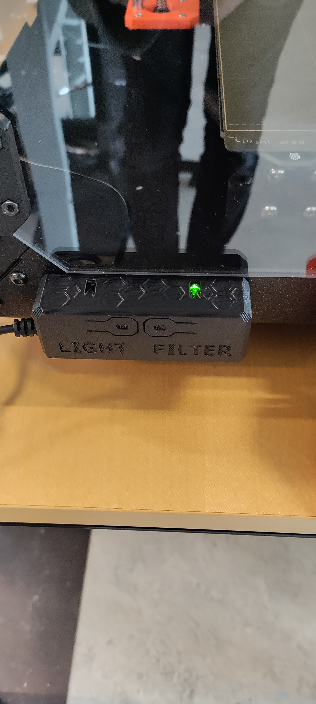

# 3D printer
## Indhold
- [Før du printer](#før-du-printer)
- [Hvis man ikke vil lave sin egen fil](#hvis-man-ikke-vil-lave-sin-egen-fil)
- [Gør fil klar til print i PrusaSlicer](#g%C3%B8r-fil-klar-til-print-i-prusaslicer)
- [Hvis man skal skifte filament](#hvis-man-skal-skifte-filament)
  - [Load filament](#load-filament)
  - [Unload filament](#unload-filament)
- [Brug af filter til usunde materialer](#brug-af-filter-til-usunde-materialer)
- [Optionelle tricks til bedre print](#ekstra-tricks-til-bedre-print)
- [Materiale](#materiale)
  - [Fjerne færdigt print:](#fjerne-f%C3%A6rdigt-print)
- [Design af egne modeller](#design-af-egne-modeller)
  - [Valg af program](#valg-af-program)

## Før du printer
Når man bruger Lab'ets Prusa i3 MK3S+ eller Prusa Mini+ printere så kræver det at man har føglende:

 1. Hvis det er første gang, skal man have snakket med en ansat i Lab'et
 2. En 3D-fil af filtypen STL eller OBJ.
 3. En computer med [PrusaSlicer](https://www.prusa3d.com/page/prusaslicer_424/) installeret.
 4. Et SD Kort (hvis man bruer de store MK3S+ printere eller en USB-stick hvis man bruger en MINI+ printer - der bør sidde et kort i MK3S+ pritnerne lige til venstre for displayet og et USB-stick på højre side af MINI+ printerne lige ved tænd/sluk knappen.
 5. Et [link til DD Labs webshop](http://ddlab.au.dk/webshop) til betaling af materiale.

## Hvis man ikke vil lave sin egen fil
Det kan være vanskeligt og tidskrævende at designe sin egen fil. Heldigvis findes [Thingiverse](https://www.thingiverse.com/), som er en delingside for makere, hvor man kan downloade gratis 3D-modeller af alt fra skakbrikker til droneskeletter.

I dette eksempel vil jeg tage udgangspunkt i en [Skak Bonde](https://www.thingiverse.com/thing:4901226/files) fra sættet "Hexagon Chess Set".

## Gør fil klar til print i PrusaSlicer
Næste trin er at åbne sin 3D-fil i PrusaSlicer. Dette kan gøres ved at trykke på `File` ➝ `Import` ➝ `Import STL/Obj/...` og så vælge sin STL/Obj/... fil.

Filen er nu importeret og man kan da ændre på størrelsen af printet og orientering ved hjælp af værktøjerne i venstre side. Hvis du ikke kan se din fil kan det ske du skal skifte til "3D editor view" ved at trykke på kassen i nederste venstre hjørne)

Her er et par ekssempler på hvordan man ville sikre sig at ens print er i den rigtige orientation og størrelse. For eksempel, hvis nu ens print er blevet importeret men vender forkert kan man enten roterer det, eller bruge "place on face" funktionen i prusaSlicer. place on face er god hvis man har en bestemt flad side man gerne vil have sit print til at ligge på.
Hvis man manuelt roterer kan man enten i højre side skrive rotations værdier ind (hvis man har valgt sit objekt med venstreklik) eller trække i de håndtag der dukker om om ens model når man vælger "Rotate"-værktøjet.

Et tip til rotationsværktøjet er at hvis man holder sin mus over de guide linjer (markeret med rød) der vises når man har valgt på hvilken akse man roterer, kan man rotere i præcise intervaller af 45˚.

Derefter kan man justere størrelsen på sin fil med "scale" værktøjet i samme værktøjsrække som "rotate", eller man kan skrive værdier ind manuelt til højre, igen ligesom med rotate værktøjet, nu bruger man blot felterne ud fra "Size:"

Når filen har de rigtige dimensioner og er lagt korrekt ned på printpladen **med den største flade side nedad for et stabilt print** skal man gøre klar til at "slice" sin fil. Her oversætter PrusaSlicer ens model til et instruktioner om hvordan printeren skal bevæge sig på baggrund af alle de instillinger man bruger i ens "slicer" f.eks. PrusaSlicer. 

Nu har man mulighed for at justere de indstillinger vi gerne vil have sliceren bruger til at printe vores model. Det er nu vi indstiller hvilket filament (materiale) der gøres brug af, hvilken detaljegrad man vil printe i, og andre indstillinger temperatur for printpladen og dyssen som fiallamentet smeltes igennem skal have. Det kan lyde overvældende, men heldigvis kan man komme virkeligt langt med de indstillinger PrusaSlicer bruger som default for den type filament man bruger så **husk læs hvad der står på siden af den rulle filament i bruger**. Grundlæggende er der kun 3 indstillinger man skal indstille:

1. Det kan være en god idé at starte fra bunden af de tre indstillinger PrusaSlicer har i højre side før man slicer. Start derfor med at vælge hvilken printer der gøres brug af. I denne guide tages der udgangspunkt i Prusa printerne "Original Prusa i3 MK3S & MK3S +", men benytter man en "Prusa Mini+" printer skal man ændre "Printer"-indstillingen til "Original Prusa MINI & MINI+". 
(hvis den type printer man vil bruge ikke dukker op er det fordi man ikke har tilføjet den printer i løbet af konfigurationen da man første gang åbnede PrusaSlicer. Man kan tilføje en ny printer ved at køre "configuration assistant" igen i prusa slicer.)

2. Derefter vælger man det filament (materiale) man vil printe i, det er en god ide at kigge på hvilke muligheder der er men PLA er ofte et godt sted at starte, ellers er der yderligere information om de forskellige filamenter DD lab har længere nede i tips og tricks sektionen. Printer man f.eks. i PLA vælger man "Generic PLA" som sin "Filament"-indstilling. Det kan også være en god idé at klikke på tandhjulet ud for ens filament-indstilling og dobbelttjekke PrusaSlicers default værdier og sammenligne dem med de anbefaligner der står på filamentrullen. Hold specielt øje med at diameteren er rigtig (Prusa printere kan **KUN** printe med 1.75mm filament), og at de forskellige temperature er sat korrekt i overenstemmelse med de anbefalinger der står på rullen.

 

3. Print settings. Her vælger man hvilket overordnet preset man vil gøre brug af (en god default er at bruge 0.20mm QUALITY). Det kan anbefales at slice ens fil i et par forskellige af dem for at se nederst til højre i vinduet (under "Sliced info") hvor lang tid det tager at printe og hvor meget filament der bliver brugt med de forskellige presets. For eksempel: hvis man vælger "0.10mm DETAIL" som ens Print setting, tager dette print af skakbonden 1 time og 59 min, og bruger 6.62 gram filament. Med en indstilling sat til 0.20mm SPEED tager printet "kun" 1 time og bruger 6.34 gram filament. For at se tid og gram klikker man blot "slice now" i bunden af programmet efter at have ændret indstillinger og så kan det ses lige over knappen under "Sliced info". 

Du undrer dig måske over hvordan det samme print printet hurtigere eller langsommere kan bruge mindre eller mere filament. Det er blandt andet fordi, indfyldningen "infill" inden i printet ændres i forskellige presets, hvis man vil se dette selv kan man trække i den bar der vises på næste billede for at se et tværsnitsnit af ens print.

Når disse 3 indstillinger er sat rigtigt, er man klar til at slice sin fil en sidste gang og eksportere den som g-code til et SD-kort (eller USB stik hvis man printer på en MINI+). Dette gøres ved sætte SD kort eller USB-stick (alt efter hvilken pritner man bruger) i sin computer og trykke på "export G-code knappen" der hvor "slice" knappen var før. Sørg for at den fil der bliver genereret hedder noget i kan genkende, og overfør den til SD-kortet eller USB-sticken.

Vi er nu næsten klar til at printe, men før man kan sætte printeren igang skal man lige sikre sig at alt er som det skal være:

1. At det filament der er i printeren svarer til det filament man justerede sine indstillinger ud fra i sliceren. (hvis ikke [skal man skifte filament](#hvis-man-skal-skifte-filament) 
2. At den stålplade plade der sidder på printeren er den rigtige for det materiale man printer med. Man bruger den glatte og grønlige "Smooth" til PLA og den lidt texturerede "Satin" til PETG og ASA f.eks. 
  1. Hvis man skifter plade skal man vælge den tilsvarende "Sheet profile" på MK3S+ printerens skærm. På MINI+ printerne anbefales det ikke at skifte plade uden hjælp fra en ansat da det kræver at man indstiller printerens Z-offset manuelt og man kan beskadige printeren hvis man gør det forkert.
3. At pladen er ren. Put en lille smule isopropyl-alkohol (IPA) på noget køkkenrulle agtigt papir (der er en stor rulle ovre ved resin-printeren) og tør pladen af med det.

Man kan nu sætte sit SD-kort (eller USB-stick) med ens fil ind i printeren og begynde sit print. Hvis man ikke har brugt en prusa printer før så navigeres menuerne med det sorte hjul der kan roteres for at bevæge sig i menuen og trykkes på for at vælge menupunkter. Hvis ikke ens fil dukker op når man sætter kortet i printeren kan man klikke på hjulet for at gå til hovedmenuen og her gå til "print from SD" som bringer en liste over alle filer på SD-kortet op så vælger man den fil man gerne vil printe. Printeren går så igang med at varme op, calibrere og printe ens fil. MINI+ pritnernes menuer er lidt anderledes men det er samme overordnede funktionalitet.

## Hvis man skal skifte filament
### Load filament
For at loade en ny rulle filament skal printeren først ikke have noget filament i sig, hvis den har filament i sig gå til [Unload filament](#Unload_filament).

Start med at tjekke at enden på dit filament ikke er tykkere end resten af rullen, hvis den er det skal du klippe en centimeter eller to af enden, ellers bilver det svært at føre filamentet ind i printeren.

Man starter derefter med at tænde for pritneren (knappen sidder uden på enclosurekassen bagerst til vesntre) og sætte ens filamentrulle fast på filamentrulleholderen inde i printer enclosuret (den kasse printeren står i). Holderen sidder øverst til højre. For nogle ruller med et mindre hul i midten skal holderen først skrues af og føres igennem rullen før man kan skrue den i igen med filament rullen på sig. Sørg for at sikre, at rullen sidder fast i en fornuftig retning så filamentet naturligt bliver trukket fra bunden af spolen og op i filamentindgangen som set på billedet. Dette gøres for at filamentet ikke bøjer unødvendigt: 

Nu føres filamentet, uden at presse for hårdt, igennem filamentindgangen: 

Når filamentet når printhovedet mærker du modstand, hvis printeren ikke er varm bliver du bedt om at vælge hvilken type filament du prøver at indsætte. Vælg det rigtgie pateriale på skærmen og vent på at printeren varmer op. Når den bipper skal du tage fat i filamentet og trykke på knappen mens du skubber fat men ikke alt for hårdt på filamentet indtil du kan mærke printhovedet griber fat i filamentet og begynder at trække de igennem sig. Slip filamentet. filamentet er nu i printeren. Hvis printeren *er* varm begynder den bare at hive i filamentet så snart spidsen af filamentet når printhovedet: hjælp bare filamentet på vej indtil printeren selv griber fat og du kan mærke den trækker i filamentet

Printren vil efter kort tid spørge om filamentet bliver "extruded" med den rigtige farve. Hvis det er den rigtige farve plastik der kommer ud, er fillamntet nu loadet. Vælg "Yes" på skærmen.
Hvis ikke, så vælg nej (*no*) og vent til plastikken der kommer ud er den rigtige farve. du kan eventuelt prøve at hjælpe filamentet igennem bowden tuben lidt mere, hvis du kan mærke på filamentet at printeren ikke trækker i det. Hvis printren stadigt ikke kan få fat i filamentet, kan bowden tuben skrues af hvor den sidder fast på printhovedet, så kan man lidt nemmere skubbe filamentet ned i printeren. Se:

Kan man stadigt ikke få printeren til at gribe filamentet bør man tage fat i en ansat. 

### Unload filament
For at unload filament tændes printeren, derefter vælger man i hovedmenuen, som navigeres med det sorte hjul foran på printeren, "unload filament". Printren vil spørge hvilken type filament man unloader og man vælger bare den der passer til det filament der sidder i printeren. Er man i tvivl bør det stå på siden af filamentrullen. Når indstillingen er valgt, varmer printeren på og når den er varm lyder der et *højt* bib. Dette bib betyder, at du skal tage fat i filamentet og hive det roligt men jævnt ud af printeren. Igen kan man som når man loader filament nyde godt af at skrue bowden tuben af der hvor den sidder fast på printhovedet for nemmere at kunne hive i filamentet. Gør man dette skal man selvføgligt huske at skrue den på igen bagefter. Sørg for at spidsen af filamentet ikke krydser ind under filamentet på spolen når du tager det ud af printeren, så kommer der nemlig en knude på spolen der kan ødelægge et fremtidigt print. Der er små orange filament clips i kasserne med filament der kan bruges til at holde styr på enden når du pakker spolen ned.

Skrue tube af            |  Skrue tube på igen
:-------------------------:|:-------------------------:
  |  

Hvis man syntes man hiver til men filamentet stadigt sidder fast bør man tage fat i en ansat *Så står man ikke til ansvar når filamentet knækker i printeren og man skal skille den ad ;)*

## Brug af filter til usunde materialer

*For PLA, som er det mest hyppigt brugte materiale, er filteret ikke nødvendigt.*

Nogle materialer er ikke sunde at indånde dampene fra f.eks. PETG, ABS og der er det vigtigt at man tænder for filteret inde i enclosuret mens printet køre. Dette gøres ved en knap på forsiden af enclosuret lige til venstre for displayet. Se:

Filter slukket             |  Filter tændt
:-------------------------:|:-------------------------:
  |  

Da MINI+ printerne ikke har et enclosure bør man ikke Printe ABS og andre usunde materialer på dem.

**Held og lykke!**

## Ekstra tricks til bedre print

### Print Settings
Under kan man indstille forskellige andre indstillingere end de førhennævnte. En af de vigtigste er "Infill". Infill beskriver hvor meget printeren fylder ind i indersiden modellen. Hvis man skal printe noget der kan holde til noget, så kan man med fordel sætte infill procenten op. Eksemplet med skakbrikken forsøger jeg med 15% fyld. Man skal være opmærksom på at dette gør printetiden længere samt printet dyrere hvis man øger indfill da der bruges mere materiale. Høj infill er den største forøgelse af pris og tid man kan gøre sig i, men kan nogle gange være nødvendigt. Meget sjældent er der brug for værdier over 50%, men det kommer kraftigt an på ens print, det anbefales at starte rimeligt lavt (35% og mindre) hvis man ikke skal ligge et kraftigt tryk på ens print. Skal man dog ligge et stærks tryk på ens print f.eks. hvis man printer tandhjul med små tænder, dørstoppere osv, kan man med fordel øge sit infill til 50% og op. Det skal siges at der er "diminishing returns" jo højere man går. Et 100% infill er som oftest ikke meget stærkere end et 70%, men et 50% er langt stærkere end et 20%.

### Support  
Support skal sættes til hvis der frithængende elementer på ens model, da printeren ikke kan lægge plastik ovenpå luft. Support kan ses som et stillads som printeren bruger til at printe de frithængende dele af en model.
Jo mere support der skal bruges jo større er sandsynligheden for fejl-print, men der bruges også væsentlig mere materiale. Derfor anbefales det at man roterer sin model så der skal bruges så lidt support som muligt.  

### Build plate  
Det kan tit være en fordel at printe sin model på en bund, så der er et lag mellem printerens byggeplade og ens 3D-model. Hvis man vil have det skal man tjekke 'Build Plate' kassen af.

## Materiale
Vi har flere forskellige typer af materiale-ruller. Herunder kan nævnes PLA, Nylon, TPU, PC og PVA. Hvilket materiale man vælger at anvende, kommer an på ens print og hvad man skal bruge det til. Hvis der ikke er nogen specikke krav til printet, anbefaler vi at man bruger PLA.

**PLA:**
Den oftest brugte er typen PLA, hvilket er en miljøvenlig plastik, da den er bionedbrydelig. Dermed ikke sagt at man bare skal printe løs og smide det i naturen, for det kræver særlige forhold at nedbrude materialet. Printer man noget, må det gerne være for sjov, det skal også bare have sted i verden (eksempelvis awesome digital design prototyper).

**Nylon:**
Nylon bruges til industrielle dele. Den er bedst i styrke, fleksibilitet og udholdenhed. Den kan farves, både før og efter printprocessen. Dens negativ side er at der er en større risiko for at printet warper imens det bliver printet.

**TPU:**
TPU er en plastiktype med gummikvaliteter. Det betyder at den er mere fleksibel og udholdende end f.eks. PLA. Det er blødt og modstandsdygtigt, og egner sig derfor godt til at lave wearables.

**PC:**
PC er den stærkeste type 3d-print materiale. Den kan holde til ekstrem varme og slag. Det er gennemsigtigt og bruges blandt andet til skudsikkert glas, dykkermasker og lign. PC har en smule fleksibelt, og kan bøjes.
Under print kan der opstå en del warping så det kan være sværere at bruge end andre materialer.

**PVA:**
PVA er en form for vandopløseligt plastik. Det er godt at bruge til at lave mere avancerede prints, da det kan bruges til at printe supports.

### Fjern færdigt print
For at undgå at bøje sit print anbefaler vi at lade printet og printpladen køle, så løsner ens print sig selv en del fra pladen og kan nemt tages af. Prusa printernes plader er yderligere let bøgelige og kan løfte der hvor der er fingerprint markeringer i den side af pladen der vender mod en selv, prøv at lade være med at efterlade for mange fingeraftryk og fedt på pladen af dette gør den sværre at printe på. Printen kan dog tages af og bøges let for at løsne et print der sidder på pladen.

Hvis printet har en stor kontaktflade med printerens seng, så kan man fremskynde processen ved at tage glasset (glas i ultimaker printerne den bøgelige bund i prusa printerne) og lægge det i køleskabet.
For at få fat under printet og vippe det af, kan man bruge en [jimmy](https://www.ifixit.com/Store/Tools/Jimmy/IF145-259-1). Her skal man dog være meget forsigtig, så pladen ikke ridses det mindste, generelt er dette ikke anbefalet.

## Design af egne modeller

### Valg af program
Der findes ufattelig mange programmer til at lave 3D-modeller og er man allerede ekspert i et 3D program, så skal man endelig benytte det. I Lab'et anbefaler vi at man starter med programmet [Tinkercad](https://www.tinkercad.com), der er en begyndervenlig introduktion til 3d-modellering.
Skal man lave mere avancerede modeller kan man bruge programmet [Fusion360](https://www.autodesk.com/products/fusion-360/students-teachers-educators) der laves at Autodesk som er gratis for studerende [Autodesk educational access signup](https://www.autodesk.com/education/edu-software/overview?sorting=featured&filters=individual). Fusion er en industristandard, hvor man nemmere kan lave mere komplekse modeller og arbejde cloud baseret med resten af sin gruppe, men dog kræver at man bruger en del mere tid på at komme godt ind i programmet. Er man kun interesseret i at arbejde individuelt kan man med fordel bruge programmet Inventor der ikke er cloud baseret, men har tilgængeld højere funktionalitet i at kunne simulere sammensætninger af 3D modeller og lave plantegninger i samme program hvis man har behov for at sende tegninger til firmaer der skal fremstille komponenter for en i metal. Fusion 360 bør være nok til alt vi laver her på studiet og langt det meste man kunne komme til at lave senere. 

Når ens model er designet skal man blot eksportere ens model som STL eller OBJ fil og gøre som ellers i guiden.
