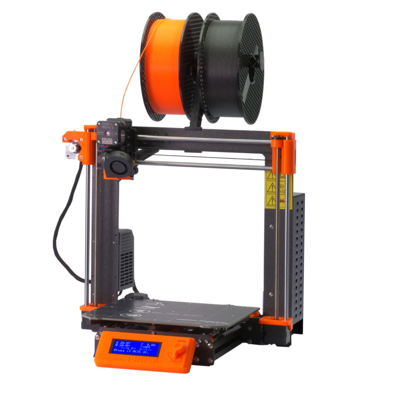
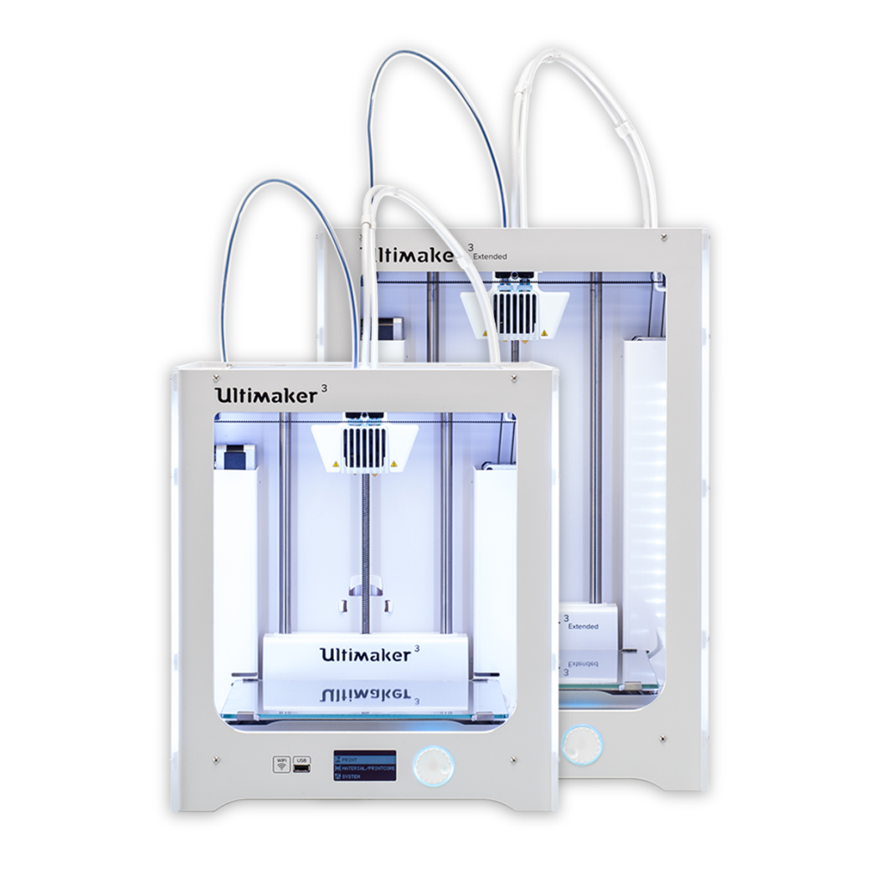
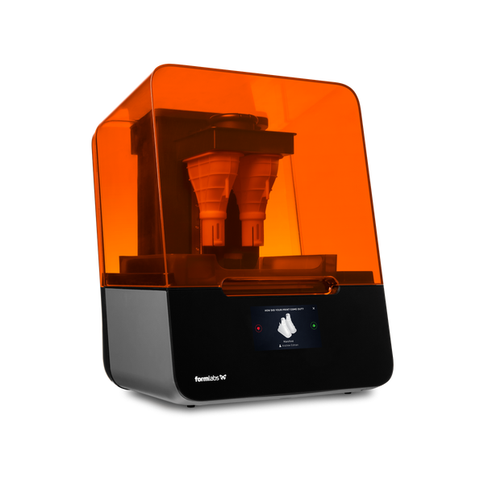

# 3D-printere i DD Lab

## DD Lab har 2 typer af 3D printere:
- **FDM-Printere**(Fused Deposition Modeling), også kaldet filament-printere, der printer ved at materiale opvarmes og presses ud af en dyse og lægges lag for lag indtil modellen er færdig. Materialet kan være PLA, Nylon, TPU, PC eller PVA.
- **SLA-printer**(Stereolithography), som printer ved at hærde resin i lag med UV-lys

## Guides
### Filamentprintere

[Prusa printere](3dprinter/Prusa-Printere/)

[Ultimaker printere](3dprinter/Ultimaker-Printere/)

### Resinprinter

[Form 3 printer](3dprinter/Form3-Printer/)
