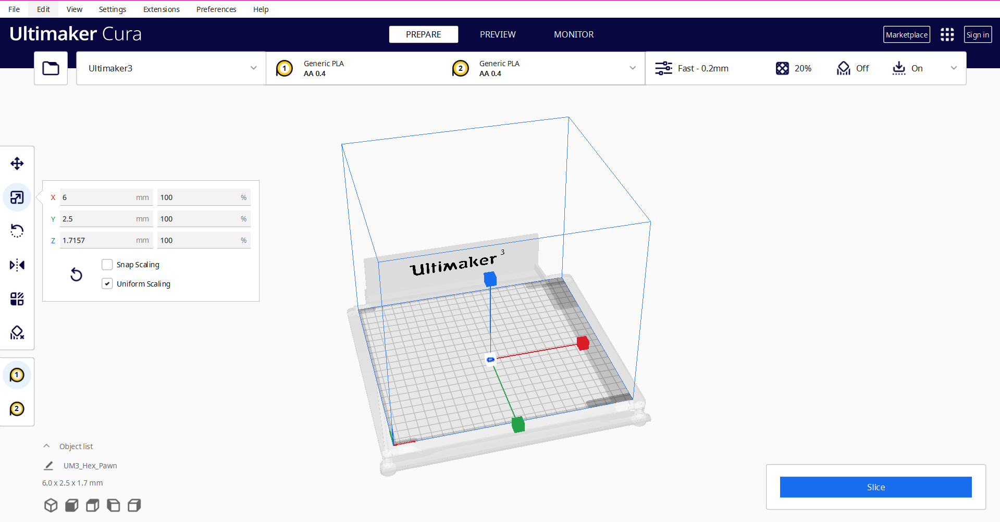
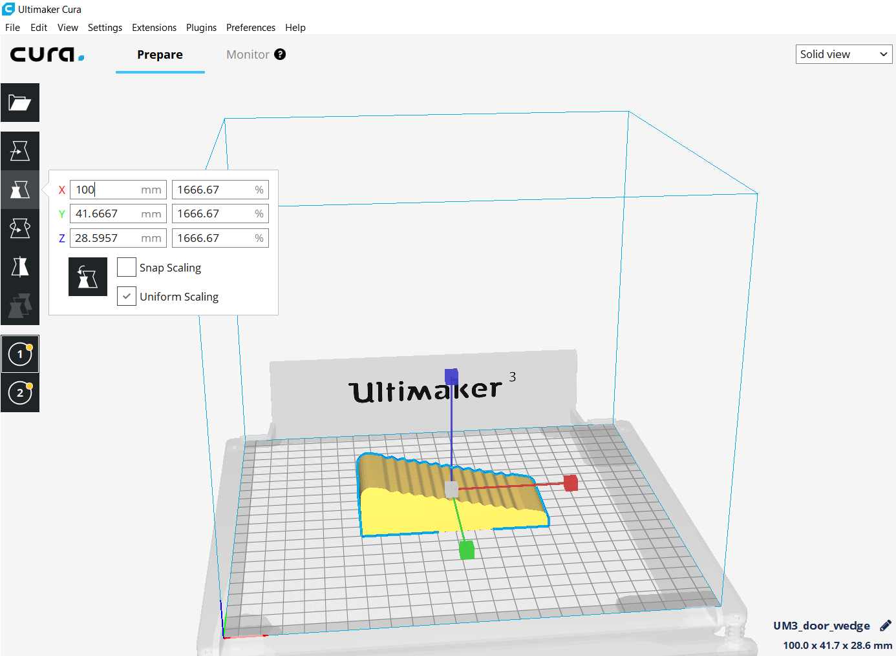
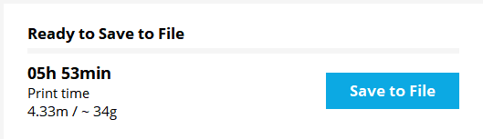
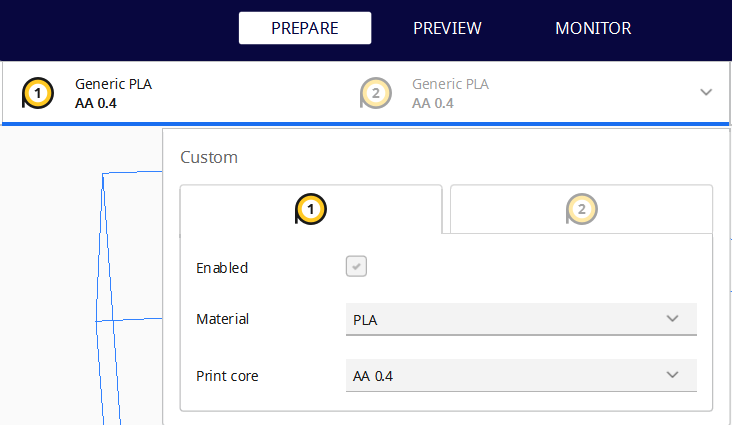
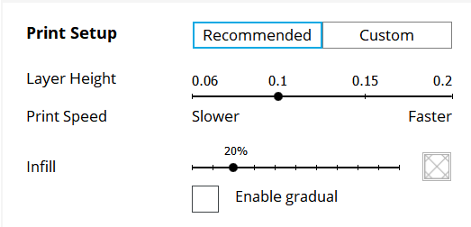

# Ultimaker 3d-filamentprintere
## Indhold
- [Før du printer](#før-du-printer)
- [Find fil på Thingiverse](#find-fil-p%C3%A5-thingiverse)
- [Gør fil klar til print i Cura](#g%C3%B8r-fil-klar-til-print-i-cura)
- [Tricks til bedre print](#tricks-til-bedre-print)
- [Materiale](#materiale)
  - [Skift materiale:](#skift-materiale)
  - [Fjerne færdigt print:](#fjerne-f%C3%A6rdigt-print)
- [Design af egne modeller](#design-af-egne-modeller)
  - [Valg af program](#Valg-af-program)

## Før du printer
Når man bruger Lab'ets Ultimaker 3 så kræver det at man har følgende:

0. Hvis det er første gang, skal man have snakket med en ansat i Lab'et
 1. En 3D-fil af filtypen STL eller OBJ.
 2. En computer med [Ultimaker Cura](https://ultimaker.com/en/products/ultimaker-cura-software) installeret.
 3. USB-pen.
 4. Et [link til DD Labs webshop](http://ddlab.au.dk/webshop) til betaling af materiale.

## Find fil på Thingiverse
Det kan være vanskeligt og tidskrævende at designe sin egen fil. Heldigvis findes [Thingiverse](https://www.thingiverse.com/), som er en delingside for makere, hvor downloade gratis 3D-modeller af alt fra skakbrikker til skelettet til droner.

I dette eksempel vil jeg tage udgangspunkt i en [dørstopper](https://www.thingiverse.com/thing:2642527).

## Gør fil klar til print i Cura
Næste trin er at åbne sin 3D-fil i Cura. Dette kan gøres ved at trykke på `File` ➝ `open File(s)` og så vælge sin fil.

Filen er importeret og man kan nu ændre på størrelsen på printet og orientering ved hjælp af værktøjerne i venstre side.  

Som det kan ses på billedet er filen for lille til at virke på som en dørstopper så derfor skal den skaleres op.  

Når filen har de rigtige dimensioner skal den eksporteres til gcode (som printeren kan læse), ved at trykke på "Save to File" i højre bund af programmet. Ved siden af knappen kan man se hvor langt tid printet tager samt printets vægt som skal bruges til betalling i DD Lab's webshop.  

## Tricks til bedre print
### Materiale & extruder  
I højre top kan man vælge hvilken "extruder" printeren skal bruge samt hvilket materiale der er tale om. Det er muligt at vælge begge extruders i samme print, men det tager VÆSENTLIG længere tid samt der er større sandsynlighed for fejl-print.  

### Print Setup  
Under indstillinger for for materialer og extruders finder man print setup. Den indstilling der hedder 'recommended' er den der almindeligvis skal bruges, men skal man have lavet noget mere avanceret, så tag fat i en ansat fra lab'et.  
Infill beskriver hvor meget printeren fylder ind i modellen. Hvis man skal printe noget der kan holde til noget, så kan man med fordel sætte infill procenten op. Eksemplet med dørstopperen sætter forsøger jeg med 50% fyld. Man skal være opmærksom på at dette gøre printetiden længere samt printet dyrere da der bruges mere materiale.  

### Support  
Support skal sættes til hvis der frithængende elementer på ens model, da printeren ikke kan lægge plastik ovenpå luft. Support kan ses som et stillads som printeren bruger til at printe de frithængende dele af en model.
Jo mere support der skal bruges jo større er sandsynligheden for fejl-print, men der bruges også væsentlig mere materiale. Derfor anbefales det at man roterer sin model så der skal bruges så lidt support som muligt.  

### Print core
På Ultimaker 3 Extended sidder der en printcore på 0,8mm. Denne printcore tilader at man kan øge layer hight og dermed kan printe færre lag hvilket gør printet hurtigere. Da lagene kan printes tykkere vil de også blive mere tydelige og kvaliteten bliver ikke så høj. Dvs. at den printer med bredere og højere linjer.

### Build plate  
Det kan tit være en fordel at printe sin model på en bund, så der er et lag mellem printerens byggeplade og ens 3D-model. Hvis man vil have det skal man tjekke 'Build Plate' kassen af.

### Limstift varmepladen  
For at være sikker på at printet binder til "sengen" (glaspladen i bunden af printeren), kan man påføre et tyndt lag af almindelig limstift. Nederst til højre i reolen ved siden af printerne er der en blå kasse i med gule limstifter i.  
Inden i påfører lim skal i sørge for at der ikke sidder gamle rester på, men endnu vigtigere, så **skal** glasset vaskes rent efter **hvert** print.
Rengøring af glasset foregår under varmt vand i køkkenet. Her er det vigtigt at være forsigtig med at håndtering af glasset.
For at tage bunden ud drejes de to metal klamper væk fra midten og glasset kan forsigtigt tages ud.

Vi har tidligere eksperimenteret med at bruge tape og spidersheet på glaspladen. Det har vi foretrukket fordi de betyder mindre håndtering af selve pladen. Derfor opfordrer vi alle der bruger printeren til at være ekstra påpasselige med ikke at ridse eller splintre med glasset, så vi forsat kan printe.

## Materiale
Vi har flere forskellige typer af materiale-ruller. Herunder kan nævnes PLA, Nylon, TPU, PC og PVA. Hvilket materiale man vælger at anvende, kommer an på ens print og hvad man skal bruge det til. Hvis der ikke er nogen specikke krav til printet, anbefaler vi at man bruger PLA.

**PLA:**
Den oftest brugte er typen PLA, hvilket er en miljøvenlig plastik, da den er bionedbrydelig. Dermed ikke sagt at man bare skal printe løs og smide det i naturen, for det kræver særlige forhold at nedbrude materialet. Printer man noget, må det gerne være for sjov, det skal også bare have sted i verden (eksempelvis awesome digital design prototyper).

**Nylon:**
Nylon bruges til industrielle dele. Den er bedst i styrke, fleksibilitet og udholdenhed. Den kan farves, både før og efter printprocessen. Dens negativ side er at der er en større risiko for at printet warper imens det bliver printet.

**TPU:**
TPU er en plastiktype med gummikvaliteter. Det betyder at den er mere fleksibel og udholdende end f.eks. PLA. Det er blødt og modstandsdygtigt, og egner sig derfor godt til at lave wearables.

**PC:**
PC er den stærkeste type 3d-print materiale. Den kan holde til ekstrem varme og slag. Det er gennemsigtigt og bruges blandt andet til skudsikkert glas, dykkermasker og lign. PC har en smule fleksibelt, og kan bøjes.
Under print kan der opstå en del warping så det kan være sværere at bruge end andre materialer.

**PVA:**
PVA er en form for vandopløseligt plastik. Det er godt at bruge til at lave mere avancerede prints, da det kan bruges til at printe supports.

### Skift materiale
Der sidder en NFC-chip (Near Field Communication chip) i flere af lab'ets ruller med 3D-printer plast. Fordelen ved at bruge dem er at man ikke manuelt skal intaste hvilket materiale man bruger. Dog er det ikke svært at skrive ind manuelt og rullerne uden NFC er billigere. Derfor vil vi gerne opfordre til at man bruger de billige til test print og tidlige prototyper.  

### Fjern færdigt print
For at undgå at bøje sit print anbefaler vi at lade printet og glaspladen køle ned inden man fjerner det fra platformen. Hvis printet har en stor kontaktflade med printerens seng, så kan man fremskynde processen ved at tage glasset og lægge det i køleskabet.   
For at få fat under printet og vippe det af, kan man bruge en [jimmy](https://www.ifixit.com/Store/Tools/Jimmy/IF145-259-1). Her skal man dog være meget forsigtet, så glaspladen ikke ridses.

## Design af egne modeller

### Valg af program
Der findes ufattelig mange programmer til at lave 3D-modeller og er man allerede ekspert i et 3D program, så skal man endelig benytte det. I Lab'et anbefaler vi at man starter med programmet [Tinkercad](https://www.tinkercad.com), der er en begyndervenlig introduktion til 3d-modellering.
Skal man lave mere avancerede modeller kan man bruge programmet [Fusion360](https://www.autodesk.com/products/fusion-360/students-teachers-educators) som er gratis for studerende. Fusion er en industristandard, hvor man nemmere kan lave mere komplekse modeller, men dog kræver at man bruger en del mere tid på at komme godt ind i programmet.
